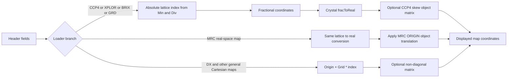

# PyMOL Handling of MRC and CCP4 Volume Origins

## Executive summary

PyMOL’s current public code base for map loading is still the long-standing `ObjectMap.cpp` path in the open-source tree, and the current official product line on the PyMOL site is PyMOL 3.1.8 as of March 18, 2026, while the public `pymol-open-source` repository was updated in November 2025. I did not find evidence in the public sources of a 2026-era replacement map loader for MRC or CCP4 volumes. citeturn42view0turn15search3

For **strict CCP4 crystallographic maps**, PyMOL’s behavior is largely correct. It uses `NCSTART/NRSTART/NSSTART`, `NX/NY/NZ`, `CELLA/CELLB`, and `MAPC/MAPR/MAPS` to convert stored map lattice indices into fractional coordinates and then into Cartesian orthogonal coordinates, which is exactly the model described by the CCP4 map library documentation. PyMOL also applies CCP4 skew matrices when present. citeturn52view0turn27view0turn28search4

For **strict MRC real-space maps**, PyMOL’s behavior is also mostly correct, but only when the file is treated as **MRC**, not as strict CCP4. In that path, PyMOL applies the header `ORIGIN` fields as an object-space translation in angstroms and then ignores `N*START` to avoid double-shifting. That design is consistent with PyMOL’s own MRC export logic and with common cryo-EM practice, although the MRC family has a long history of ambiguous origin conventions and the 2014 specification still leaves some behavior to software interpretation. citeturn27view0turn28search5turn19view0

The main correctness risk is **not the math itself**, but **which semantic branch gets chosen**. If a map that really relies on MRC `ORIGIN` is loaded through the **CCP4** path, PyMOL will ignore `ORIGIN`. Conversely, if a strict crystallographic CCP4 map is forced through the MRC path, PyMOL may apply the wrong semantics. In practice, the most important user-visible rule is simple: **load true cryo-EM maps as `mrc`**, and let strict crystallographic files stay `ccp4`. citeturn27view0turn28search4turn30search1turn19view0

Two other practical caveats matter. First, PyMOL’s native loader only supports MRC modes **0, 1, and 2**, even though MRC2014 defines additional modes such as **6** and **12**. Second, PyMOL’s exporter writes self-consistent files, but it uses a non-default axis-order labeling strategy that depends on readers actually honoring `MAPC/MAPR/MAPS`. Both choices are defensible, but both can cause interoperability surprises. citeturn27view0turn19view0

## File-format semantics that control map placement

The MRC2014 specification defines `NX/NY/NZ` as the stored array dimensions on the **fast**, **medium**, and **slow** axes, `NXSTART/NYSTART/NZSTART` as the location of the first stored samples in the full unit-cell grid, `MX/MY/MZ` as the full sampling counts along the crystallographic X, Y, and Z axes, `CELLA/CELLB` as unit-cell dimensions and angles, and `MAPC/MAPR/MAPS` as the mapping from file axes to X, Y, and Z. For non-transform maps, the `ORIGIN` triplet is the real-space location of a subvolume in angstroms. citeturn27view0

The older CCP4 map library documentation describes the same core layout for crystallographic maps, but it explicitly treats skew matrices as a CCP4 feature and notes that **CCP4 format does not use the MRC `ORIGIN` words**, whereas MRC does. CCP4 also documents the skew transform as

`Xo(map) = S * (Xo(atoms) - t)`

which is the exact relation PyMOL comments against in its source. citeturn52view0turn28search4

That distinction matters. In a strict crystallographic CCP4 interpretation, map placement comes from **cell geometry plus start indices plus axis mapping**. In a strict MRC real-space interpretation, map placement often comes from **`ORIGIN` in angstroms**, with `N*START` either unused or treated as secondary. PyMOL mirrors that split. citeturn27view0turn28search4turn19view0

EMDB states that the archive follows the **CCP4 definition** for distributed maps and remediated the archive to improve uniformity of header parameters. That makes PyMOL’s CCP4/EMDB treatment plausible for archive maps fetched from EMDB, even though many local third-party cryo-EM tools write files that users informally call “CCP4/MRC” while really expecting MRC-style `ORIGIN` behavior. citeturn29view0turn27view0

One more subtle but important point is axis order. The `mrcfile` reference implementation notes that it **does not transpose data according to `MAPC/MAPR/MAPS`**, and instead exposes the array in NumPy’s usual `data[z][y][x]` layout unless the caller handles axis mapping manually. PyMOL, by contrast, does actively remap stored file axes into its internal x, y, z coordinate system. That is a strength of PyMOL’s native CCP4/MRC loader. citeturn56view3turn19view0

## PyMOL code paths and internal mapping

At the user level, `load` chooses a reader from the file extension unless the format is overridden explicitly. PyMOL’s documentation states that the format string can be used to override the extension, which is the key workaround when a file’s suffix does not match the origin convention it actually uses. citeturn30search1turn30search7

In the current public source tree, native map reading lives in `layer2/ObjectMap.cpp`. The relevant entry points are `ObjectMapLoadCCP4`, `ObjectMapLoadXPLOR`, `ObjectMapLoadDXFile`, `ObjectMapLoadBRIXFile`, `ObjectMapLoadPHI`, and `ObjectMapLoadGRDFile`. The CCP4 and MRC family both feed through `ObjectMapCCP4StrToMap`. The same file also contains the exporter `ObjectMapStateToCCP4Str`. citeturn19view0

PyMOL classifies **CCP4, BRIX, GRD, and generic crystallographic maps** as “xtal-valid” map sources, which means later containment and interpolation steps use the crystallographic path. In that path, PyMOL transforms real coordinates into fractional coordinates with `realToFrac()`, multiplies by `Div`, and checks against `Min` and `Max`. In the non-crystallographic path, it instead uses explicit Cartesian `Origin` and `Grid` vectors. citeturn45view0turn47view4turn47view5

For native crystallographic maps, the effective mapping is:

```text
axis_file = (column, row, section)
axis_cart = (X, Y, Z)

I[MAPC-1] = column_index  + NCSTART
I[MAPR-1] = row_index     + NRSTART
I[MAPS-1] = section_index + NSSTART

f = ( I_x / NX , I_y / NY , I_z / NZ )
r_cart = fracToReal(f)
r_display = M_object * r_cart
```

Here `M_object` is normally identity, but it becomes nontrivial if PyMOL applies a CCP4 skew transform or an MRC `ORIGIN` translation. There is **no half-voxel correction** anywhere in this path. PyMOL treats the density samples as being located exactly at these lattice points. citeturn52view0turn27view0turn19view0

For native general-purpose Cartesian maps, the effective mapping is instead:

```text
r_cart = Origin + Grid * (local_index + Min)
r_display = M_object * r_cart
```

and the current source uses the explicit `Origin` and `Grid` values in containment tests and point regeneration. citeturn24view2turn47view4

The current MRC/CCP4 branch in `ObjectMap.cpp` does four placement operations that matter most:

| Operation | What PyMOL does | Why it matters |
|---|---|---|
| `MAPC/MAPR/MAPS` | Converts header values from 1-based axis IDs to internal 0-based indexing, then writes `FDim`, `Min`, and `Max` into internal x, y, z slots accordingly | This is the axis-swap handling that makes non-default axis orders work |
| `N*START` | Stores absolute grid starts directly into `Min[]` and uses them in the fractional-coordinate formula | This sets the real-space subvolume position for strict crystallographic maps |
| CCP4 skew | If the file is treated as CCP4 and `LSKFLG` is set, PyMOL applies the skew transform as an object matrix | This is the crystallographic non-orthogonal map-frame correction |
| MRC `ORIGIN` | If the file is treated as MRC and `ORIGIN != 0`, PyMOL applies `ORIGIN` as an object translation and then ignores `N*START` | This is the cryo-EM style real-space placement branch |

These behaviors come from the current `ObjectMapCCP4StrToMap` and `ObjectMapStateToCCP4Str` logic in `layer2/ObjectMap.cpp`. citeturn19view0

A compact view of the transform flow is:



The current exporter is also informative. In `ObjectMapStateToCCP4Str`, PyMOL’s comments explicitly distinguish CCP4 from MRC, state that MRC “can have ORIGIN,” and say MRC “can’t have N*START” or at least should avoid mixing it with ORIGIN because of convention problems. The exporter therefore converts the internal start offset into real-space angstroms, adds that to MRC `ORIGIN`, and then zeroes `N*START` for MRC output. That round-trip logic is internally consistent with the import rule above. citeturn19view0

## Correctness assessment

For **strict crystallographic CCP4**, PyMOL is doing the correct thing. It uses the full CCP4 model: start indices, whole-cell sampling, axis mapping, unit-cell geometry, and skew matrices. That matches the CCP4 library description closely enough that I would consider PyMOL’s placement behavior correct for well-formed CCP4 maps. citeturn52view0turn28search4turn19view0

For **strict real-space MRC**, PyMOL is also doing the right thing when the file is actually loaded as **MRC**. The MRC2014 page defines `ORIGIN` for non-transform modes as the real-space location of the subvolume. PyMOL’s current MRC branch applies `ORIGIN` as a Cartesian translation and suppresses `N*START` to avoid double-counting the same shift. That is a reasonable and common interpretation for cryo-EM maps. citeturn27view0turn19view0

The biggest practical misbehavior is therefore **format-selection dependent**, not formula dependent. A map with meaningful MRC `ORIGIN` that gets read as strict `.ccp4` will be misplaced because the CCP4 branch ignores `ORIGIN` by design. A strict crystallographic CCP4 map that is forced through `format=mrc` could also be misinterpreted if it contains nonzero values in the nominal ORIGIN words for unrelated reasons. In other words, the math is correct inside each branch, but **the branch choice can be wrong for hybrid or mislabeled files**. citeturn27view0turn28search4turn30search1turn19view0

There is one further interoperability issue on **export**. PyMOL writes map headers with `MAPC=3`, `MAPR=2`, and `MAPS=1`, and writes `NC/NR/NS` from internal z, y, x dimensions. That is legal because the header explicitly declares the axis permutation, and the CCP4/MRC specs allow non-default axis mapping. However, this is fragile against outside tools that silently assume `MAPC=1`, `MAPR=2`, `MAPS=3`. So I would call PyMOL’s export **spec-compliant but less interoperable than necessary**. citeturn27view0turn52view0turn19view0

PyMOL is also incomplete relative to full MRC2014 support. The current loader accepts only map modes **0, 1, and 2**, while the 2014 spec includes additional modern modes such as **6** and **12**. That does not make origin handling wrong, but it does mean that some modern MRC files are unsupported before origin logic is even reached. citeturn27view0turn19view0

Finally, PyMOL does not solve the **handedness** problem because the MRC2014 specification itself says handedness is not well defined and may differ across producing software. PyMOL effectively trusts the file and does not add a handedness correction layer. If a producing package wrote a left-handed interpretation, PyMOL will visualize that left-handed data unless the file was preconverted elsewhere. citeturn27view0

## Minimal reproducible tests

The most informative tests are tiny maps whose first nonzero voxel is supposed to land on a known PDB atom. The **expected** positions below come from the CCP4/MRC specifications, and the **source-predicted observed** PyMOL behavior comes from the current `ObjectMap.cpp` logic. These tests do not require alignment commands if the headers are correct. citeturn27view0turn30search7turn19view0

### Test-header matrix

| Test | File identity | Key header values | Expected first nonzero voxel in Cartesian Å | Source-predicted PyMOL result |
|---|---|---|---|---|
| ORIGIN-only MRC | `format=mrc` | `NX=NY=NZ=MX=MY=MZ=2`, `CELLA=(2,2,2)`, `MAPC/R/S=(1,2,3)`, `N*START=(0,0,0)`, `ORIGIN=(10,20,30)` | `(10,20,30)` | Overlaps an atom at `(10,20,30)` |
| NSTART-only CCP4 | `format=ccp4` | `NX=NY=NZ=MX=MY=MZ=10`, `CELLA=(10,10,10)`, `MAPC/R/S=(1,2,3)`, `N*START=(2,3,4)`, `ORIGIN=(0,0,0)` | `(2,3,4)` | Overlaps an atom at `(2,3,4)` |
| Mixed MRC | `format=mrc` | Same as above, but `N*START=(2,3,4)` and `ORIGIN=(10,20,30)` | `(10,20,30)` | `ORIGIN` wins, `N*START` is ignored |
| Mixed CCP4 | `format=ccp4` | Same mixed header | `(2,3,4)` | `N*START` wins, `ORIGIN` is ignored |
| Axis-swapped CCP4 | `format=ccp4` | `MAPC/R/S=(3,2,1)` with orthogonal cell and zero shifts | Voxel-numbering swaps so file columns advance along Z, not X | PyMOL should place peaks according to header axis mapping, not file-default X,Y,Z assumptions |

The most important distinction is the **mixed-header pair**. If the same physical file produces different placement under `format=mrc` and `format=ccp4`, then the file is exposing exactly the ambiguity that PyMOL’s two semantic branches encode. citeturn27view0turn28search4turn19view0

### Minimal synthetic MRC writer

This example uses `mrcfile`, which is useful for simple orthogonal tests. Remember that `mrcfile` itself does **not** transpose data according to `MAPC/MAPR/MAPS`, so it is ideal for the first four tests but not ideal for writing a non-default axis-order test unless you transpose the array deliberately yourself. citeturn53search1turn56view3

```python
import numpy as np
import mrcfile

# 2 x 2 x 2 volume, indexed by mrcfile as data[z, y, x]
data = np.zeros((2, 2, 2), dtype=np.float32)
data[0, 0, 0] = 10.0

with mrcfile.new("origin_only.mrc", overwrite=True) as m:
    m.set_data(data)
    m.header.mx = 2
    m.header.my = 2
    m.header.mz = 2
    m.header.cella = (2.0, 2.0, 2.0)
    m.header.cellb = (90.0, 90.0, 90.0)
    m.header.mapc = 1
    m.header.mapr = 2
    m.header.maps = 3
    m.header.nxstart = 0
    m.header.nystart = 0
    m.header.nzstart = 0
    m.header.origin = (10.0, 20.0, 30.0)
    m.header.ispg = 1
```

A matching one-atom PDB can be:

```text
ATOM      1  C   UNK A   1      10.000  20.000  30.000  1.00 20.00           C
END
```

In PyMOL, the minimal visual test is:

```pml
load atom_at_10_20_30.pdb, prot
load origin_only.mrc, map, format=mrc
isomesh mesh, map, 5.0
show sticks, prot
zoom prot or mesh
```

For the first test, the mesh should sit on the atom without any manual translation. For the mixed-header tests, the same file should move when you switch between `format=mrc` and `format=ccp4`. That branch sensitivity is the whole point of the test. citeturn30search1turn30search7turn19view0

### Practical interpretation guide

If you are testing a cryo-EM map from cryoSPARC, RELION, Warp, Dynamo, or IMOD, run the mixed-header check early. If the map lands correctly only under `format=mrc`, then the file is using MRC-style `ORIGIN` semantics and should not be trusted under strict CCP4 loading. If it lands the same in both paths, the header is either consistent in both conventions or uses only one of them. citeturn27view0turn28search5turn19view0

## Support across volume formats

The official PyMOL file-format page lists **CCP4, XPLOR, O/OMAP/DSN6/BRIX, PHI, DX, Cube, and MTZ** under volumetric data, with an asterisk marking plugin-backed formats. The current open-source Python importer still routes unrecognized extensions through the VMD molfile plugin architecture, and the current source also has explicit `fetch(..., type='emd')` support for EMDB maps. At the same time, the present open-source `load_mtz` path raises an `IncentiveOnlyException`, so MTZ is not currently available in the open-source build despite the older general documentation table. citeturn30search0turn31view1turn50view4

| Format | Public support status by 2026 | Native or plugin | Coordinate basis in PyMOL | Placement reliability relative to PDB | Known issues and workarounds |
|---|---|---|---|---|---|
| CCP4 | Documented load and save support, with save documented since 1.8.4. Current source still uses native loader. citeturn30search0turn42view0 | Native | Crystallographic cell, `N*START`, `MAPC/R/S`, optional CCP4 skew. citeturn52view0turn19view0 | Good for strict crystallographic files | If file is actually EM-style MRC with nonzero `ORIGIN`, use `format=mrc` instead. citeturn28search4turn30search1turn19view0 |
| MRC | Not prominently documented on the old format page, but current source supports native MRC load and export in the same code path. citeturn19view0turn42view0 | Native | Same as CCP4 plus MRC `ORIGIN` handling in angstroms. citeturn27view0turn19view0 | Good for cryo-EM maps if loaded as MRC | Loader only supports modes 0, 1, 2. Use external conversion for mode 6 or 12 files. citeturn27view0turn19view0 |
| XPLOR | Officially documented load support. citeturn30search0 | Native | Crystallographic cell and start limits | Usually good for structure-factor derived maps | Uses crystallographic semantics, not MRC-style ORIGIN. citeturn30search0turn19view0 |
| OMAP DSN6 BRIX | Officially documented load support. citeturn30search0 | Native | Treated as xtal-valid in current source for later interpolation | Generally good when headers are correct | Historical DSN6 endianness and scaling issues remain external file-quality risks. citeturn30search0turn45view0turn19view0 |
| DX | Officially documented load support. citeturn30search0 | Native | Explicit `Origin` and `Grid`; non-diagonal delta is stored as an object matrix in current source | Good for Cartesian fields | If exact orientation matters, prefer native DX over plugin formats because the path is transparent in source. citeturn30search0turn19view0 |
| PHI | Officially documented load support. citeturn30search0 | Native | General cartesian map path | Usually good for electrostatics maps | Older format, limited metadata. citeturn30search0turn19view0 |
| Cube | Officially documented with plugin asterisk. citeturn30search0 | VMD plugin | Plugin-defined | Often fine, but less transparent than native loaders | When exact overlap matters, preconvert to DX or MRC/CCP4 and compare. The native MRC/CCP4 origin logic does not apply here. citeturn30search0turn31view1 |
| EMDB archive maps | Current `fetch type=emd` support exists in source. PyMOL downloads `emd_<id>.map.gz` but names the local file as `.ccp4`. citeturn50view4 | Native CCP4 path after fetch | EMDB says archive distribution follows CCP4 definition | Usually good for remediated archive maps | If a local non-archive `.map/.mrc` file from EM software is shifted incorrectly, try `format=mrc`. citeturn29view0turn30search1turn19view0 |
| MTZ | Listed in the old documentation, but current open-source source raises `IncentiveOnlyException`. citeturn30search0turn50view4 | Incentive-only in open source | Reflection-data derived maps, not direct voxel import in current open source | Not applicable in open-source build | Use Incentive PyMOL or external conversion to CCP4/MRC. citeturn50view4 |

## Suggested fixes and patches

The most valuable fix would be an **explicit origin-policy switch** for CCP4/MRC-family loaders. PyMOL currently bakes the policy into the selected load type. A better design would expose a setting such as:

```text
set map_origin_policy, auto
# auto | ccp4 | mrc-origin | nstart
```

with `auto` doing something like:

- if strict `ccp4` requested, keep strict CCP4 semantics
- if strict `mrc` requested, keep MRC semantics
- if format is ambiguous, and `ORIGIN != 0` with no CCP4 skew and EM-like space-group usage, warn and prefer MRC semantics

That would preserve backward compatibility while making ambiguous files much easier to diagnose. The motivation comes directly from the documented CCP4 versus MRC split and PyMOL’s current hard branch between them. citeturn28search4turn27view0turn19view0

A second useful patch would be **better warnings**. Right now, the branch can silently do the wrong thing for mislabeled files. A warning like

> nonzero ORIGIN found in CCP4 mode, ORIGIN will be ignored

would save users a great deal of time. The same warning should appear when `N*START` and `ORIGIN` are both nonzero in MRC mode and PyMOL elects to ignore `N*START`. citeturn27view0turn19view0

A third patch would improve interoperability on export. PyMOL should ideally offer an option to write **canonical axis order** with `MAPC=1`, `MAPR=2`, `MAPS=3` and physically transpose the data on save, instead of relying on other readers to honor a non-default mapping. The present export is legal, but a canonical export mode would be safer for downstream tools that are weak on `MAPC/MAPR/MAPS`. citeturn27view0turn52view0turn19view0

A fourth patch is straightforward engineering: add support for MRC2014 modes **6** and **12** in the native loader. That would remove a common source of failure for newer cryo-EM pipelines without touching origin behavior. citeturn27view0turn19view0

The regression tests I would add first are exactly the synthetic cases above:

| Test name | What it should assert |
|---|---|
| `mrc_origin_only` | `format=mrc` places the first voxel at `ORIGIN` |
| `ccp4_nstart_only` | `format=ccp4` places the first voxel at `N*START * cell / N` |
| `mrc_origin_and_nstart` | `format=mrc` ignores `N*START` when `ORIGIN != 0` |
| `ccp4_ignores_origin_words` | `format=ccp4` ignores MRC `ORIGIN` words |
| `axis_swap_mapc_321` | non-default `MAPC/R/S` transposes placement correctly |
| `export_roundtrip_mrc` | save then load preserves visible placement |
| `export_roundtrip_ccp4` | save then load preserves visible placement |

If these tests pass, then the remaining origin-placement failures users see in practice will usually be traceable to **ambiguous file conventions**, **handedness**, or **downstream tools that ignore axis-order fields**, not to PyMOL’s core lattice math. citeturn27view0turn52view0turn19view0